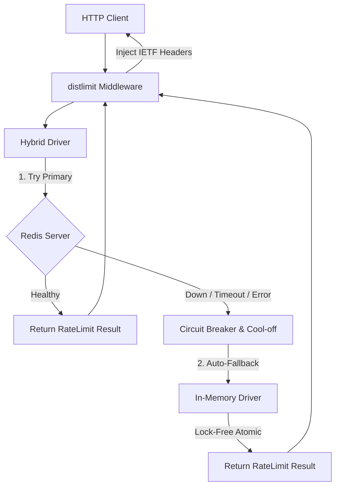

# ⚡ distlimit — High-Performance & Resilient Hybrid Rate Limiter for Go

**`distlimit`** is an enterprise-grade rate-limiting library for Golang designed for extreme throughput (**nanosecond-level latency**) and zero-downtime resilience.

It combines the blazing speed of local in-memory evaluation (L1) via **Lock-Free Atomics (`sync/atomic`)** with the multi-node accuracy of distributed Redis (L2) using **Atomic Lua Scripting**. It features an automatic **Graceful Failover Mechanism** to protect your applications if the Redis instance encounters an outage or network partition.

---

## 🏗️ Architecture & Failover Flow

`distlimit` utilizes a **Dual-Tier Hybrid Architecture** equipped with a _Circuit Breaker Cool-Off_ mechanism. This guarantees that your application will never throw HTTP 500 errors or experience latency spikes due to Redis infrastructure issues.



---

## ✨ Key Features

- **Zero-Dependency Core:** The root package relies purely on the Go Standard Library, avoiding transitive dependency bloat.
- **Lock-Free In-Memory Engine:** Built with `sync/atomic` (Compare-And-Swap) instead of traditional `sync.Mutex`, delivering nanosecond evaluations with **0 B/op heap memory allocation**.
- **Atomic Redis Lua Scripting:** Implements the _Sliding Window Log_ algorithm executed atomically in a single network round-trip to Redis.
- **Graceful Redis Fallback:** Automatically degrades evaluation to local memory if Redis goes down, ensuring zero application downtime.
- **Circuit Breaker Cool-Off:** Prevents overwhelming a recovering Redis server by applying a configurable cool-off period during failover.
- **IETF Standard RateLimit Headers:** Injects standard HTTP response headers (`RateLimit-Limit`, `RateLimit-Remaining`, `RateLimit-Reset`, and `Retry-After`) automatically.
- **Plug-and-Play Middleware:** Provides turn-key adapters for Go's native `net/http` and the `Gin Gonic` web framework.

---

## 📦 Installation

```bash
go get github.com/balramadan/distlimit

```

---

## 🚀 Quick Start

### 1. Basic Usage with `net/http` (In-Memory Driver)

```go
package main

import (
	"context"
	"net/http"
	"time"

	"github.com/balramadan/distlimit"
	"github.com/balramadan/distlimit/driver/memory"
	distlimithttp "github.com/balramadan/distlimit/middleware/nethttp"
)

func main() {
	// 1. Initialize In-Memory Driver
	memDriver := memory.New(1 * time.Minute)
	defer memDriver.Close(context.Background())

	// 2. Create Limiter (100 requests per minute)
	limiter, _ := distlimit.New(
		memDriver,
		distlimit.WithLimit(100),
		distlimit.WithWindow(1*time.Minute),
	)

	// 3. Attach Middleware to net/http Handler
	mux := http.NewServeMux()
	mux.HandleFunc("/api/hello", func(w http.ResponseWriter, r *http.Request) {
		w.Write([]byte("Hello, World!"))
	})

	protectedHandler := distlimithttp.New(limiter)(mux)
	http.ListenAndServe(":8080", protectedHandler)
}

```

### 2. Advanced Usage with Gin Framework (Hybrid Driver + Fallback Alert)

```go
package main

import (
	"context"
	"log"
	"time"

	"github.com/balramadan/distlimit"
	"github.com/balramadan/distlimit/driver/hybrid"
	"github.com/balramadan/distlimit/driver/memory"
	"github.com/balramadan/distlimit/driver/redis"
	distlimitgin "github.com/balramadan/distlimit/middleware/gin"
	"github.com/gin-gonic/gin"
	goredis "github.com/redis/go-redis/v9"
)

func main() {
	rdb := goredis.NewClient(&goredis.Options{Addr: "localhost:6379"})

	// Setup Driver L1 (Memory) and L2 (Redis)
	memDriver := memory.New(1 * time.Minute)
	redisDriver := redis.New(rdb, redis.WithPrefix("prod:rate:"))

	// Assemble Hybrid Driver with Automatic Failover
	hybridDriver := hybrid.New(
		redisDriver,
		memDriver,
		hybrid.WithCoolOffDuration(5*time.Second),
		hybrid.WithOnError(func(err error) {
			log.Printf("ALERT: Redis outage detected! Falling back to In-Memory: %v", err)
		}),
	)
	defer hybridDriver.Close(context.Background())

	limiter, _ := distlimit.New(
		hybridDriver,
		distlimit.WithLimit(60),
		distlimit.WithWindow(1*time.Minute),
	)

	r := gin.Default()
	r.Use(distlimitgin.New(limiter)) // Apply globally

	r.GET("/api/ping", func(c *gin.Context) {
		c.JSON(200, gin.H{"message": "pong"})
	})

	r.Run(":8080")
}

```

---

## 📊 Performance & Benchmarks

Benchmarked on Linux x86_64 with data race detection enabled (`go test -race`):

| Benchmark Scenario                       | Iterations Executed | Speed / Latency   | Memory Allocated | Allocs per Op   |
| ---------------------------------------- | ------------------- | ----------------- | ---------------- | --------------- |
| **Memory Driver (Single Thread)**        | 337,962             | **3,327 ns/op**   | **0 B/op**       | **0 allocs/op** |
| **Memory Driver (Parallel Multi-Core)**  | 697,014             | **1,732 ns/op**   | **0 B/op**       | **0 allocs/op** |
| **Redis Driver (Atomic Lua Round-Trip)** | 2,864               | **349,191 ns/op** | 760 B/op         | 28 allocs/op    |

> **Key Insight:** The local In-Memory driver achieves **0 B/op and 0 allocs/op**, placing zero strain on the Go Garbage Collector (GC) during evaluation.

---

## 📋 Standard HTTP Response Headers

Every request processed by `distlimit` automatically receives standard IETF-compliant response headers:

| Header Name           | Type    | Description                                                       |
| --------------------- | ------- | ----------------------------------------------------------------- |
| `RateLimit-Limit`     | Integer | Maximum request quota within the active window                    |
| `RateLimit-Remaining` | Integer | Remaining request quota in the active window                      |
| `RateLimit-Reset`     | Integer | Seconds remaining until the quota resets                          |
| `Retry-After`         | Integer | _(Sent on HTTP 429)_ Seconds the client must wait before retrying |

---

## 📂 Project Layout

```text
distlimit/
├── driver/
│   ├── memory/          # Lock-free In-Memory Storage Driver
│   ├── redis/           # Distributed Redis Lua Script Storage Driver
│   └── hybrid/          # Dual-Tier Resilient Hybrid Storage Driver
├── middleware/
│   ├── gin/             # Gin Gonic Framework Adapter
│   └── nethttp/         # Standard net/http Middleware Adapter
├── examples/            # Executable Example Applications
├── distlimit.go         # Core Limiter Interfaces & Functional Options
├── go.mod
└── README.md

```

---

## 📄 License

This project is licensed under the [MIT License](LICENSE).
